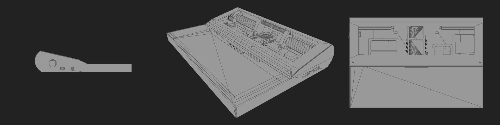
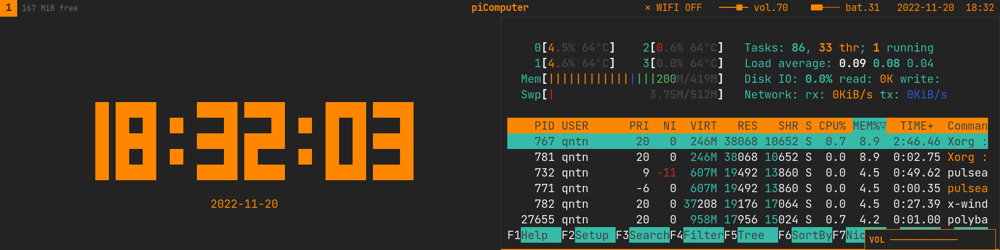

# README

```
     _ _____                   _           
 ___|_|     |___ _____ ___ _ _| |_ ___ ___ 
| . | |   --| . |     | . | | |  _| -_|  _|
|  _|_|_____|___|_|_|_|  _|___|_| |___|_|  
|_|                   |_|                  

```


## What the f* is it?
A raspberry Pi Zero 2 with a weird wide screen and a 40% mechanical keyboard in a [3d-printed case](https://github.com/qtaped/picomputer/wiki/3dprint), inspired by [lisperati1000](https://github.com/drcode/lisperati-1000-diy).  
I am a graphic designer, not an engineer neither a developer. You have been warn!

> This project is at his early stage. It is not guaranteed to work. But it works. I guess.



The interface is based on [i3](https://i3wm.org/) + [polybar](https://github.com/polybar/polybar).  

* [Installation Guide](https://github.com/qtaped/picomputer/wiki/installation)
* [Shortcuts List](https://github.com/qtaped/picomputer/wiki/shortcuts)  

Please refer to the [wiki](https://github.com/qtaped/picomputer/wiki) for more details. 

## License
[GPL-3.0-or-later](https://www.gnu.org/licenses/gpl-3.0.html) for software, and [CC-BY-4.0](https://creativecommons.org/licenses/by-sa/4.0/) for non-software parts.
